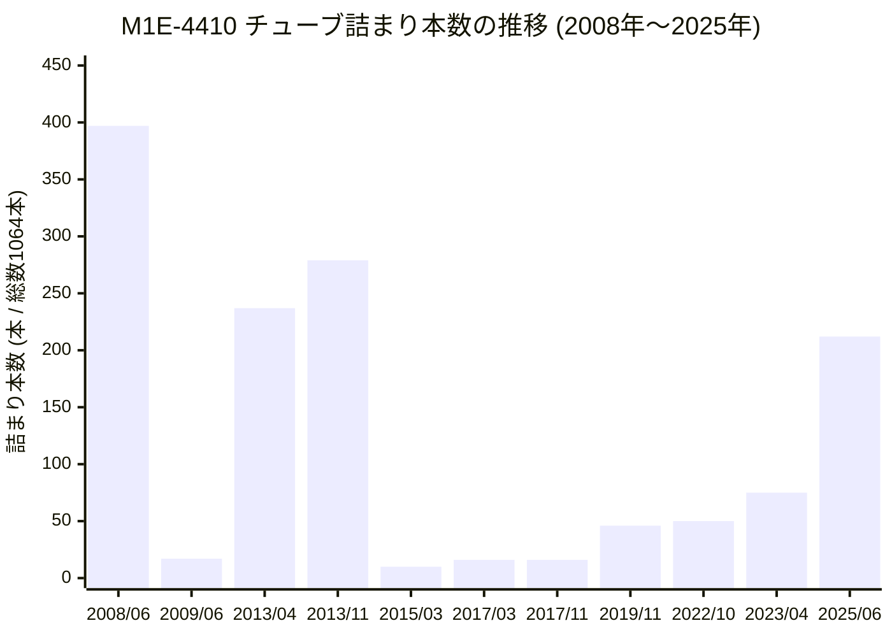

# M1粗MAA分離塔リボイラー（M1E-4410）チューブ閉塞履歴レポート

保全履歴データ（[m1e-4410_history.xlsm](file:///C:/Users/0057769/Downloads/clogging_management/data/m1e-4410_history.xlsm)）から、M1粗MAA分離塔リボイラー（M1E-4410-A / YRCリボイラー）におけるチューブの「詰まり本数（閉塞本数）」および対応履歴を抽出し、タイムライン・推移としてまとめました。

---

## 1. チューブ閉塞本数・洗浄履歴一覧

| 点検/作業時期 | 登録基準日 | 保全名称 | 閉塞本数 / 総管数 | 閉塞率 | 処置・状況・特記内容 |
| :--- | :---: | :--- | :---: | :---: | :--- |
| **2008/06** | 2008-06-10 | HH開放点検 / ﾁｭｰﾌﾞ詰まり洗浄 | **397本** / 1064本 | 37.3% | **超々高圧JET洗浄を実施**し全数貫通完了（SPM施工）。 |
| **2009/06** | 2009-06-10 | HH開放点検/ﾁｭｰﾌﾞ詰まり点検 | **17本** / 1064本 | 1.6% | JET洗浄後17本まで改善。放置・経過観察。 |
| **2013/04** | 2013-04-01 | ﾁｭｰﾌﾞ詰まり洗浄 | **237本** / 1064本 | 22.2% | **超々高圧JET洗浄を実施**（9日間で全数貫通完了）。 |
| **2013/11** | 2013-11-01 | ﾁｭｰﾌﾞ詰まり洗浄 | **279本** / 1064本 | 26.2% | 運転課より依頼（計画外）。7日間で重合物を全数完全除去通管。 |
| **2015/03** | 2015-03-01 | HH開放点検/ﾁｭｰﾌﾞ詰まり点検 | **10本** / 1064本 | 0.9% | JET洗浄は未実施、放置。 |
| **2017/03** | 2017-03-01 | HH開放点検/ﾁｭｰﾌﾞ詰まり点検 | **16本** / 1064本 | 1.5% | 閉塞率約1.5%のため生産影響なしと判断し放置。 |
| **2017/11** | 2017-11-01 | ｴﾙﾎﾞ配管取外し/ﾁｭｰﾌﾞ詰まり点検 | **16本** / 1064本 | 1.5% | 前回から進展なし。そのまま復旧。 |
| **2019/11** | 2019-11-01 | 【11月】M1E-4410解放（C/O） | **46本** / 1064本 | 4.3% | 生産調整休転工事。管内重合固化による詰まり確認後、復旧。 |
| **2022/10頃** | 2021-04-01 | ｴﾙﾎﾞ配管取外し/ﾁｭｰﾌﾞ詰まり点検 | **50本** / 1064本 | 4.7% | 再立上げに伴い内部点検・清掃を実施。放置。 |
| **2023/04** | 2023-04-01 | ｴﾙﾎﾞ配管取外し/ﾁｭｰﾌﾞ詰まり点検 | **75本** / 1064本 | 7.0% | 再立上げ後約3ヶ月稼働後の確認。放置（次回JET洗浄検討）。 |
| **2025/06** | 2025-06-30 | ｴﾙﾎﾞ配管取外し / ﾁｭｰﾌﾞ詰まり洗浄 | **212本** / 1064本 | 19.9% | 閉塞率約20%に達したため**超々高圧JET洗浄を実施**し全数貫通完了。 |

---

## 2. 閉塞本数の推移（グラフ）

> [!NOTE]
> - **定期的な超々高圧JET洗浄によるリセット**:
>   - **2008年6月**: 397本（37.3%）閉塞時にJET洗浄を実施 ➔ 2009年には17本まで改善。
>   - **2013年4月・11月**: 200本超（22〜26%）まで悪化したため連続でJET洗浄を実施 ➔ 2015年には10本まで改善。
>   - **2025年6月**: 2023年（75本）から212本（約20%）まで急増したため、**超々高圧JET洗浄を実施して全数貫通・リセット**。
> - **閉塞の特性**:
>   - 運転継続に伴い重合物の付着・固化が進み、閉塞率が20%を超えた段階で超々高圧JET洗浄を実施する運用パターンが定着しています。